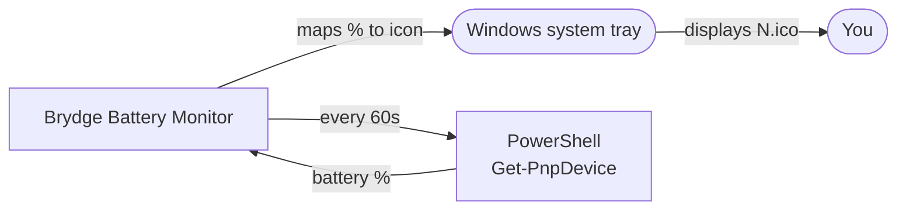
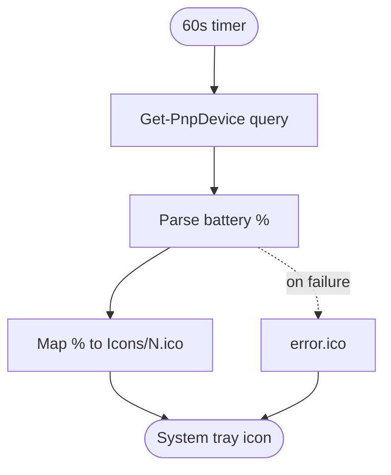

<div align="center">


# Brydge Battery Monitor

**See your Brydge keyboard's battery, right in the Windows tray.**

A lightweight system tray app that reads your **Brydge keyboard's battery percentage** and shows it as a
live tray icon. No window, no clutter. It ships in two flavors: a tiny **AutoHotkey** script and a
cross-checked **Python** port.

[](#requirements)
[](#autohotkey-version)
[](#python-version)
[](#how-it-works)
[](LICENSE)

[Quick start](#quick-start) · [How it works](#how-it-works) · [Usage](#usage) · [Compare](#how-it-compares) · [Architecture](#architecture) · [FAQ](#faq) · [License](#license)

</div>

---

<br>**Brydge Battery Monitor** is a small Windows utility that keeps an eye on your **Brydge keyboard's
battery level** and turns it into a tray icon you can read at a glance. It lives quietly in the system
tray, refreshes itself on a timer, and swaps its icon to match the current percentage.

There is no main window and nothing to babysit. Pick the implementation you prefer, drop the `Icons/`
folder next to it, and it just runs in the background.

## Why Brydge Battery Monitor

- **Battery percentage at a glance.** The current charge level *is* the tray icon (`0.ico`–`100.ico`),
  so you never have to open a window or dig through Settings.
- **Lightweight and quiet.** It runs in the background with no UI and no fuss, refreshing every 60
  seconds.
- **No drivers, no cloud.** It reads the battery straight from Windows via a PowerShell `Get-PnpDevice`
  query against the connected Brydge device. Nothing phones home.
- **Two implementations, same behavior.** A minimal **AutoHotkey** script or a **Python** port using
  `pystray` and `Pillow`, pick whichever fits your setup.
- **Clear error state.** If the battery can't be read, it falls back to a dedicated `error.ico` so you
  know something's off.
- **Right-click to quit.** A single tray menu entry, **Exit**, and you're done.

## How it works

The app runs a simple polling loop: every 60 seconds it asks Windows for the Brydge battery level, maps
that percentage to a matching icon, and updates the tray.



1. **Query the device.** A PowerShell `Get-PnpDevice` call finds any connected `*Brydge*` device and
   reads its battery level from the device power property.
2. **Parse the percentage.** The output is stripped down to a number (0–100).
3. **Map to an icon.** The percentage selects the matching icon from `Icons/` (e.g. `87.ico`).
4. **Update the tray.** The tray icon is swapped in place. If anything fails, `error.ico` is shown
   instead.
5. **Repeat.** A 60-second timer keeps the icon current.

## Quick start

### Requirements

- **Windows 10 or 11.** The app relies on PowerShell (`Get-PnpDevice`) and the system tray.
- A connected **Brydge** keyboard that reports battery to Windows.
- For the AHK version: **AutoHotkey v1.1**.
- For the Python version: **Python 3.10+**.
- The **`Icons/`** folder (`0.ico`–`100.ico` + `error.ico`) kept next to the script/executable.

### AutoHotkey version

1. Download the latest release from [GitHub Releases](https://github.com/JoshuaALawrence/Brydge-Battery-Monitor/releases).
2. Install **AutoHotkey v1.1** from [autohotkey.com](https://www.autohotkey.com/).
3. Run `Brydge Battery Monitor.ahk` directly, or compile it to a standalone `.exe`.

> Keep the `Icons/` folder beside the script/executable so the tray icons can be found.

### Python version

1. Install **Python 3.10+** from [python.org](https://www.python.org/).
2. Clone the repository:

   ```bash
   git clone https://github.com/JoshuaALawrence/Brydge-Battery-Monitor.git
   cd Brydge-Battery-Monitor
   ```

3. Install dependencies (`pystray` and `Pillow`):

   ```bash
   pip install -r Python/requirements.txt
   ```

4. Run the app with `pythonw` so no console window appears:

   ```bash
   pythonw "Python/Brydge Battery Monitor.pyw"
   ```

## Usage

- The app runs in the background and updates the **system tray icon** to show the current battery
  percentage, refreshing every 60 seconds.
- **Right-click the tray icon** and choose **Exit** to quit.

## How it compares

Both versions do the same job and read the battery the same way. Pick whichever matches how you like to
run things.

| | AutoHotkey (`.ahk`) | Python (`.pyw`) |
| --- | --- | --- |
| **Runtime** | AutoHotkey v1.1 | Python 3.10+ |
| **Dependencies** | None beyond AHK | `pystray`, `Pillow` |
| **Footprint** | Tiny; can compile to a single `.exe` | Needs a Python interpreter |
| **Tray icon** | Native `Menu, Tray, Icon` | `pystray` icon |
| **Battery query** | PowerShell `Get-PnpDevice` | PowerShell `Get-PnpDevice` |
| **Best for** | Minimal, no-install setups | Scriptable / cross-checked port |

## Architecture

Both implementations share one flow: a timer drives a PowerShell query, the result is mapped to an
icon, and the tray is updated.



| Path | Role |
| --- | --- |
| [Brydge Battery Monitor.ahk](Brydge%20Battery%20Monitor.ahk) | AutoHotkey implementation: tray icon, 60s timer, and the PowerShell battery query. |
| [Python/Brydge Battery Monitor.pyw](Python/Brydge%20Battery%20Monitor.pyw) | Python port using `pystray` + `Pillow`, with a background updater thread. |
| [Python/requirements.txt](Python/requirements.txt) | Python dependencies (`pystray`, `Pillow`). |
| `Icons/` | Tray icons `0.ico`–`100.ico` plus an `error.ico` fallback. |

**Tech stack:** AutoHotkey v1.1 · Python 3.10+ · [pystray](https://pypi.org/project/pystray/) ·
[Pillow](https://pypi.org/project/Pillow/) · Windows PowerShell (`Get-PnpDevice`).

## Project layout

```
Brydge-Battery-Monitor/
├── Brydge Battery Monitor.ahk   # AutoHotkey version
├── Icons/                       # 0.ico–100.ico + error.ico
├── Python/
│   ├── Brydge Battery Monitor.pyw   # Python version
│   └── requirements.txt
├── LICENSE
└── README.md
```

## FAQ

**Does it work on macOS or Linux?**
No. It relies on Windows PowerShell (`Get-PnpDevice`) and the Windows system tray, so it targets
Windows 10/11 only.

**Which keyboards are supported?**
Brydge keyboards that report their battery level to Windows as a PnP device power property.

**The icon shows the error state, what's wrong?**
The battery couldn't be read, or the matching icon is missing. Make sure a Brydge device is connected
and that the `Icons/` folder (including `error.ico`) sits next to the script or executable.

**AutoHotkey or Python, which should I use?**
The AHK version is the lightest and can compile to a single `.exe`. The Python version is a
cross-checked port if you'd rather run it through Python.

**How often does it update?**
Every 60 seconds.

**How do I quit?**
Right-click the tray icon and choose **Exit**.

## Contributing

Pull requests are welcome. Fork the repo and submit a PR with your improvements.

## License

Licensed under the **APGL-3.0**. See [LICENSE](LICENSE) for details.

<div align="center">

🔋 **Brydge Battery Monitor**: your keyboard's charge, always in the tray.

</div>
